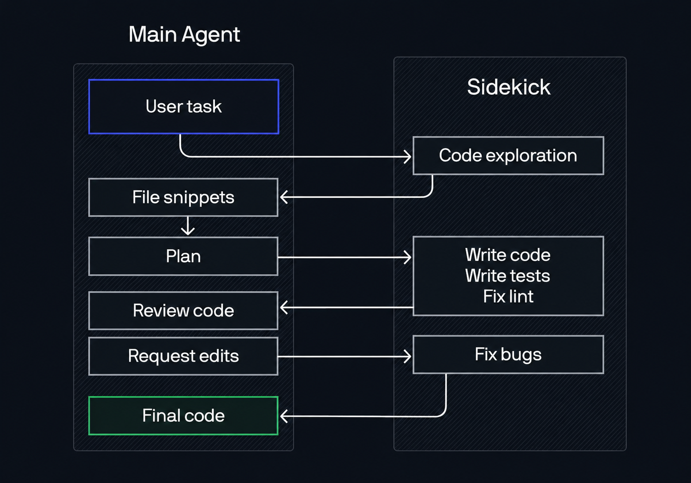

# opencode-fusion

[](https://opensource.org/licenses/MIT)

A minimal, working implementation of the [Devin Fusion "sidekick" pattern](https://cognition.com/blog/devin-fusion) for [opencode](https://opencode.ai).

Two agents run together: a **main agent** that plans and reviews, and a **sidekick** that executes. The main agent cannot edit files - it is mechanically forced to delegate all file changes to the sidekick. This keeps frontier intelligence in charge of the significant decisions (the plan, the interpretation of ambiguity, the final review) while a cheaper, faster model does the mechanical work.

Cognition describes the pattern in [Devin Fusion](https://cognition.com/blog/devin-fusion): a frontier "main agent" that plans, interprets ambiguity, and reviews, paired with a cost-effective "sidekick" that executes. They found it maintains frontier-level performance at meaningfully lower cost.

Around that core pair sits a small team of specialist subagents the main agent can delegate to: **explore** for fast read-only codebase search, plus optional **research** (external web/doc lookups), **design** (frontend/UI implementation), and **reviewer** (auditing a diff before commit). Each specialist runs on a model you pick independently - so you can put whichever model you think designs best on `design`, and a different one you trust for review on `reviewer`. Think of the repo as a catalog of roles: the core is required, and the optional specialists are pieces you add only if your workflow needs them. When the main model supports image input (most frontier models do), it reads screenshots directly; if it cannot, add the optional **vision** agent to transcribe images.

## Why

From [Cognition's blog post](https://cognition.com/blog/devin-fusion):

> the main agent should take minimal actions, and only read what is absolutely necessary. By default it should delegate and monitor, while making the significant decisions: the plan, the interpretation of ambiguity, the final review.

This repo makes that pattern work in opencode - not as a suggestion, but as mechanical enforcement. The main agent's `edit` permission is `deny`, its `grep`/`glob`/`list` are `deny`, and its `bash` is allowlisted to verification and git commands only. The only path to changing a file is the `task` tool, which delegates to the sidekick.

## How it works



The flow:

1. **User task** triggers the Main Agent, which delegates **code exploration** to the sidekick or explore agent.
2. The explorer reads the code and **sends data back** as file snippets.
3. The Main Agent uses those snippets to make a **plan**, then **assigns the task** to the sidekick (write code / write tests / fix lint).
4. The sidekick writes the code and **sends it back** for review.
5. The Main Agent **reviews the code**. If edits are needed, it **sends feedback** to the sidekick, which **fixes the issues** and sends back.
6. The reviewed code becomes the **final result** delivered to the user.

| Agent | Role | Config key | Required? |
|-------|------|------------|-----------|
| `build` | Main: plan, delegate, review | `agent.build.model` | core |
| `plan` | Plan mode: same brain as build, plans but does not execute | `agent.plan.model` | core |
| `sidekick` | Execute edits and commands | `agent.sidekick.model` | core |
| `explore` | Fast read-only exploration | `agent.explore.model` | core |
| `research` | Read-only external research (web, docs) | `agent.research.model` | optional |
| `design` | Frontend/UI implementation | `agent.design.model` | optional |
| `reviewer` | Audit a diff before commit | `agent.reviewer.model` | optional |
| `vision` | Transcribe images the main model cannot see | `agent.vision.model` | optional |

## Setup

Fusion is configured entirely through your **global** opencode config at `~/.config/opencode/` (on Windows: `%USERPROFILE%\.config\opencode\`). There is no build step and nothing to clone into your projects.

### Option A: Let opencode set it up (recommended)

This repo ships a skill, `fusion-setup`, that configures everything conversationally. Once the skill is available to opencode, just open opencode and say:

```
set up fusion
```

The agent asks which model you want for each role (main, sidekick, explore, and the optional research/design/reviewer specialists) and which provider each uses, then writes `~/.config/opencode/opencode.json`, installs the agent prompts under `~/.config/opencode/agent/`, and tells you to restart. To change models later, say "reconfigure fusion" or edit the config directly (see [Customize](#customize)).

To make the skill available, place the `fusion-setup` folder from this repo's `.opencode/skills/` into your global skills directory `~/.config/opencode/skills/`. opencode discovers it on the next start.

### Option B: Manual

If you would rather configure by hand, write `~/.config/opencode/opencode.json` yourself. Pick your own models; the structure is what matters. Keep the `build` agent's `permission` block exactly as shown - it is the mechanical core of Fusion and must not be loosened.

```json
{
  "$schema": "https://opencode.ai/config.json",
  "model": "<main-provider>/<main-model-id>",
  "provider": {
    "<your provider blocks here>": {}
  },
  "agent": {
    "build": {
      "mode": "primary",
      "model": "<main-provider>/<main-model-id>",
      "prompt": "{file:agent/build.md}",
      "permission": {
        "edit": "deny",
        "grep": "deny",
        "glob": "deny",
        "list": "deny",
        "bash": {
          "*": "deny",
          "npm run lint*": "allow",
          "npm test*": "allow",
          "npm run build*": "allow",
          "npx tsc --noEmit*": "allow",
          "npx vitest run*": "allow",
          "git diff*": "allow",
          "git status*": "allow",
          "git log*": "allow",
          "git show*": "allow",
          "git add*": "allow",
          "git commit*": "allow",
          "git push*": "allow",
          "node --version*": "allow",
          "npm --version*": "allow"
        },
        "task": "allow"
      }
    },
    "explore": { "model": "<explore-provider>/<explore-model-id>" },
    "sidekick": { "model": "<sidekick-provider>/<sidekick-model-id>" }
  }
}
```

The specialists are optional and a-la-carte. To add one, give it a model entry in the `agent` block alongside `explore`/`sidekick`, for example `"reviewer": { "model": "<provider>/<model-id>" }`, and install its prompt file. Their prompts and permissions live in `agent/research.md`, `agent/design.md`, `agent/reviewer.md`, and `agent/vision.md`. Add `vision` only if your main model cannot read images. Plan mode uses `agent/plan.md` and reuses the main model.

Then install the agent prompts so `{file:agent/build.md}` resolves:

```bash
mkdir -p ~/.config/opencode/agent
cp agent/build.md agent/sidekick.md ~/.config/opencode/agent/
```

Model references are always `provider-id/model-id`. If a model uses a provider opencode does not know yet, add a `provider` block for it (see the OpenAI-compatible template in the `fusion-setup` skill). Restart opencode after writing the config - it loads config once at startup, not mid-session.

## Example provider: Grok via progrok

Any provider works, but if you want to use xAI's Grok Composer as the fast sidekick model, [progrok](https://github.com/lidge-jun/progrok) turns a SuperGrok OAuth session into a local OpenAI-compatible endpoint:

```bash
npm install -g progrok
progrok login        # browser OAuth with your xAI account
progrok proxy        # leave this running in a terminal
```

The proxy serves at `http://127.0.0.1:18645/v1`. Point a provider block at that baseURL with any placeholder apiKey; progrok injects your real OAuth token before forwarding to xAI.

## Verify it works

Open a project with some lint errors and ask:

```
fix the lint errors in this project
```

You should see the main agent delegate exploration, receive the findings, make a plan, then delegate execution to the sidekick via the `task` tool. The sidekick makes the edits, and the main agent verifies by running `npm run lint` itself before reporting back.

## Customize

### Swap models

All agent models live in one place: `~/.config/opencode/opencode.json` under `agent`.

| Agent | Config key | Example |
|-------|-----------|---------|
| Main (build) | `agent.build.model` | `"kiro/claude-opus-4-8"` |
| Sidekick | `agent.sidekick.model` | `"kiro/claude-sonnet-5"` |
| Explore | `agent.explore.model` | `"progrok/grok-composer-2.5-fast"` |
| Research | `agent.research.model` | `"kiro/claude-sonnet-5"` |
| Design | `agent.design.model` | `"kiro/claude-sonnet-5"` |
| Reviewer | `agent.reviewer.model` | `"kiro/claude-opus-4-8"` |

Change the value, add a `provider` block if the model uses a new provider, and restart opencode. For a persistent default main model, also update the top-level `model` field. The sidekick should stay cheaper and faster than the main agent when possible. You can also run `/models` in opencode to swap the active model for the current session only.

### Adjust the bash allowlist

The main agent's bash is allowlisted to verification and git commands (`npm run lint`, `npm test`, `git diff`, `git status`, `git log`, `git show`, `git add`, `git commit`, `git push`). Edit `agent/build.md` to add or remove allowed commands in the `permission.bash` section. Keep `"*": "deny"` first so unlisted commands are blocked by default. Note that the allowlist matches each command individually - do not chain commands with `&&`, `||`, `;`, or `|`, because the chain will not match any single pattern and gets blocked.

## Troubleshooting

### The main agent edits files directly

The config was not loaded. Fully quit and restart opencode - it loads config at startup, not mid-session. Then confirm `edit: deny` is set for the build agent (in `agent/build.md` or the `opencode.json` build permission block).

### The sidekick is not being invoked

Check that `task: allow` is set for the build agent. If the `task` permission is missing or set to `deny`, the main agent cannot delegate.

### A model returns 404 or 400

The model id may be wrong or changed. Confirm the exact `provider-id/model-id` against your provider, and that the provider block's `baseURL`/`apiKey` are correct. For progrok's Grok models, the composer coding models are callable but intentionally not listed in `/v1/models`, so a missing entry there does not mean the id is wrong.

### A bash command gets blocked unexpectedly

The allowlist matches whole commands against fixed patterns. Chaining with `&&`, `||`, `;`, `|`, or wrapping in `echo` breaks the match and blocks the line. Run each allowed command as its own separate call.

## Files

| File | Purpose |
|------|---------|
| `agent/build.md` | Main agent: edit denied, search denied, bash allowlisted, task allowed, exploration + parallelization rules |
| `agent/plan.md` | Plan-mode agent: read-only inspection plus delegation, cannot execute or commit |
| `agent/sidekick.md` | Sidekick prompt (model set in `opencode.json`) |
| `agent/research.md` | Optional research specialist: read-only, web + docs |
| `agent/design.md` | Optional design specialist: frontend/UI, loads design skills |
| `agent/reviewer.md` | Optional reviewer specialist: audits diffs, read-only plus lint/test |
| `agent/vision.md` | Optional vision specialist: transcribes images when the main model has no image input |
| `.opencode/skills/fusion-setup/` | The `fusion-setup` skill: SKILL.md plus bundled agent prompts |
| `opencode.json` | Reference config for this repo (Opus main, Sonnet sidekick, Composer explore) |
| `flow-diagram.png` | Architecture diagram (Main Agent vs Sidekick swimlane) |
| `LICENSE` | MIT license |

## Built with opencode-fusion

This repo was configured using the Fusion pattern itself. The main agent planned the structure, reviewed every change, and verified against real command output. The sidekick wrote the files and ran the commands. Every change went through the flow above.

## Disclaimer

This project is not affiliated with, endorsed by, or built by the opencode team. [opencode](https://opencode.ai) is a separate project by [Anomaly](https://anoma.ly). This repo provides configuration that works with opencode but is not part of it.

## Credit

Inspired by [Devin Fusion](https://cognition.com/blog/devin-fusion) by [Cognition](https://cognition.com). The sidekick pattern and the principle that "the main agent should take minimal actions" come directly from their work.

## License

MIT
